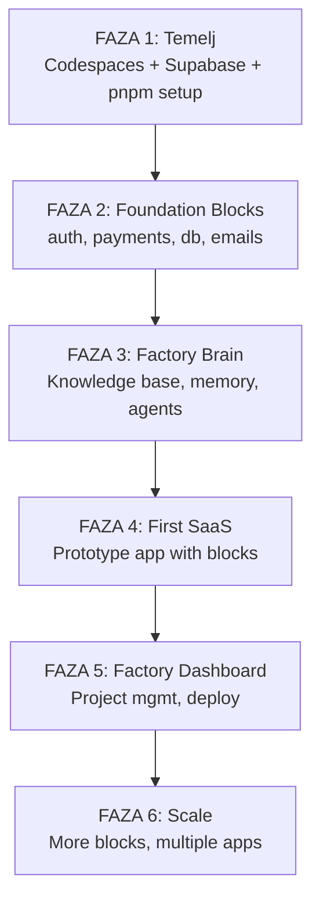

# SaaS Factory Development Plan

## Current Status
- Monorepo structure with blocks/, packages/, docs/, factory-brain/, factory-dashboard/.
- Detailed vision in [`saas-factory-kompletna-struktura.md](saas-factory-kompletna-struktura.md).
- pnpm workspace configured for packages/*.
- Early-stage: many directories exist but likely empty; focus on docs and ADRs.
- getting-started.md indicates next steps: first SaaS app, auth, CI/CD, marketing.

## High-Level Phases (Adapted from kompletna-struktura.md)

## Immediate Next Steps
See todo list for actionable items.

## Tech Stack Recommendations
- **Frontend/Backend**: Next.js 15 (App Router)
- **DB/Auth/Storage**: Supabase (PostgreSQL + RLS for multi-tenant)
- **Payments**: Stripe
- **Emails**: Resend
- **AI**: Anthropic Claude via API + pgvector for RAG
- **Deploy**: Coolify on Hetzner VPS
- **Monorepo**: pnpm workspaces + Turborepo for builds

*Plan version: 1.0 | Updated: 2026-03-09*