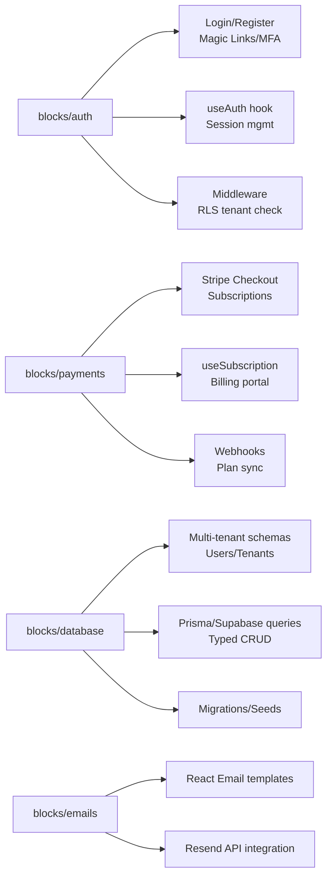

# SaaS Factory - Faza 2: Foundation Blocks Plan

## Overview
Build reusable Lego blocks for auth, payments, db, emails. Each block is a workspace package with components, hooks, API, tests, README.

Tech:
- Next.js App Router
- Supabase (auth, db)
- Stripe (payments)
- Resend (emails)
- shadcn/ui + Tailwind (UI)

## Block Breakdown

## Integration Flow
1. Add Supabase/Stripe/Resend keys to .env
2. `pnpm turbo build blocks-auth`
3. Import in test app: `import { useAuth } from '@saas-factory/blocks-auth'`

## Success Criteria
- [ ] Blocks build without errors
- [ ] Auth flow works with Supabase cloud
- [ ] Payments test checkout succeeds
- [ ] DB queries typed and tenant-isolated
- [ ] Email sends transactional mail

*Updated: 2026-03-09*