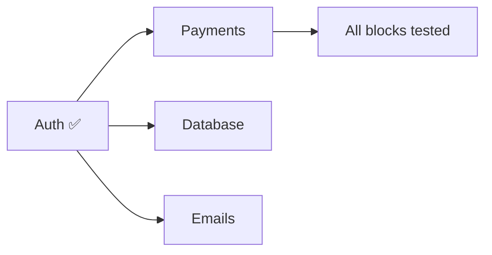
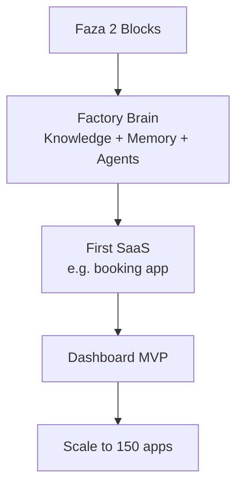

# SaaS Factory Next Steps (per kompletna-struktura.md)

## Current Progress
- ✅ Faza 1: Dev env (monorepo, tools, stubs)
- ✅ Auth block + test app ready (add Supabase keys to test)

## Remaining Faza 2 (Sedmica 3-4)
Complete Lego foundation blocks:

**Payments Block:**
- Stripe subscriptions, checkout, webhooks
- Components: PricingTable, BillingPortal
- Hooks: useSubscription

**Database Block:**
- Multi-tenant schemas (users, tenants)
- RLS policies (per ADR-001)
- Typed queries via Supabase

**Emails Block:**
- Resend + React Email
- Templates: welcome, invoice, reset

## Faza 3-6 Overview

## Immediate Action
1. Test auth: `pnpm --filter test-auth dev`
2. Switch to code for payments block
3. Provide Supabase/Stripe keys for testing

*Updated: 2026-03-09*